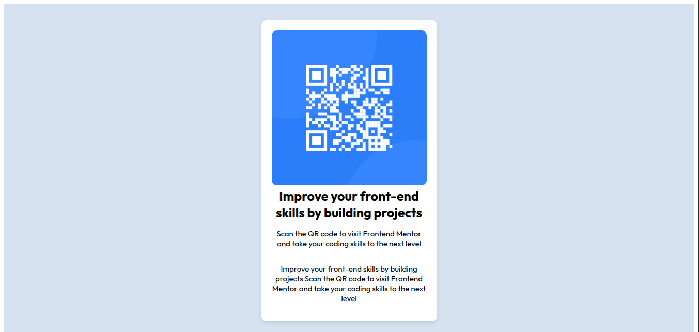

# Frontend Mentor - QR code component solution

This is a solution to the [QR code component challenge on Frontend Mentor](https://www.frontendmentor.io/challenges/qr-code-component-iux_sIO_H). Frontend Mentor challenges help you improve your coding skills by building realistic projects.

## Table of contents

- [Screenshot](#screenshot)
- [Built with](#built-with)
- [What I learned](#what-i-learned)
- [Author](#author)

### Screenshot



- Mobile-first workflow


### Built with

- Semantic HTML5 markup
- CSS custom properties
- Flexbox

### What I learned

```css
@media() {
}
```

### Continued development

I would like to focus more on media query and responsiveness and typography

## Author

- Frontend Mentor - [@Jeanclaude09-dev](https://www.frontendmentor.io/profile/Jeanclaude09-dev)
- instagram - [@iamje_nclaude](https://www.instagram.com/iamje_nclaude)
